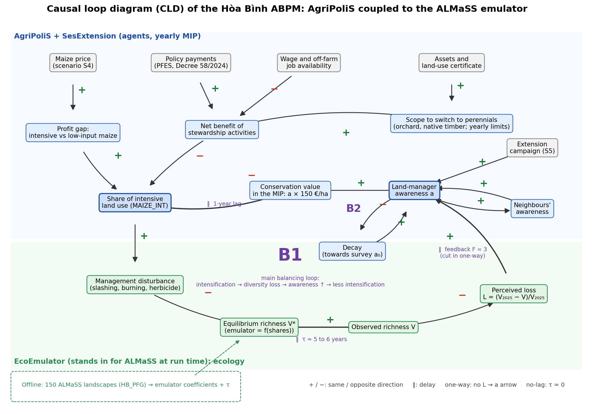
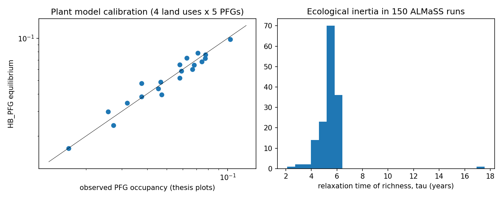
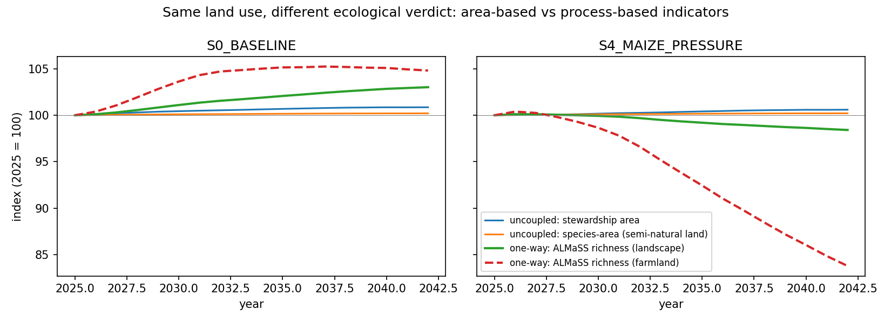
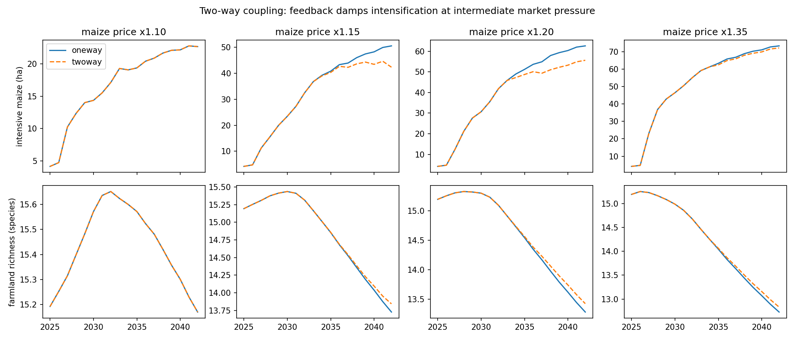
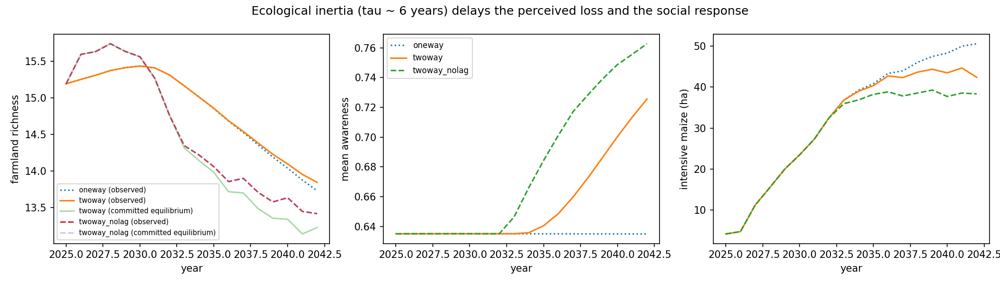
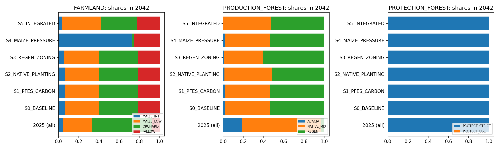

# Hòa Bình social-ecological model: AgriPoliS coupled to ALMaSS

This repository couples the agent-based farm model AgriPoliS to the landscape model ALMaSS for the uplands of Mai Châu and Đà Bắc in Hòa Bình province, Vietnam. Every year, 231 land-manager agents choose among nine land-use activities, and an emulator of a new ALMaSS plant model returns the understorey plant richness of the resulting land use. Six policy scenarios run from 2025 to 2042 in four coupling configurations.

## Research questions

The scenario experiment compares the coupling configurations on three questions:

1. Does the process-based ALMaSS indicator show changes that the area-based indicators of an uncoupled AgriPoliS miss?
2. Does feedback from perceived biodiversity loss change land use, and how does that depend on market pressure?
3. How far does ecological inertia delay the social response?

## Model

### Components

| Component | Code | Role |
|---|---|---|
| AgriPoliS2020 | [`models/agripolis`](models/agripolis) | yearly land-use decision of every agent, solved as a mixed-integer programme (MIP) |
| `SesExtension` | [`SesExtension.h`](models/agripolis/src/SesExtension.h) | social-ecological (SES) extension of the agents: awareness, asset and tenure limits, awareness dynamics |
| `EcoEmulator` | [`EcoEmulator.h`](models/agripolis/src/EcoEmulator.h) | ALMaSS emulator evaluated inside AgriPoliS every year |
| ALMaSS | [`models/almass/source_code`](models/almass/source_code) | daily landscape simulation with the `tov_HB*` vegetation types, the `HB_ScheduledPlan` management plan and the `HB_PFG` plant model |
| `hbabm` | [`src/hbabm`](src/hbabm) | Python pipeline: model inputs, calibration, ALMaSS design runs, emulator fit, scenario runs and analysis |

[`docs/ODD.md`](docs/ODD.md) describes the model following the ODD protocol, and `EcoEmulator.h` and [`HB_PFG.h`](models/almass/source_code/HB_PFG/HB_PFG.h) state the emulator and plant-model equations in their header comments.

### Land-use activities

| Land type | Activities |
|---|---|
| `FARMLAND` | `MAIZE_INT`, `MAIZE_LOW`, `ORCHARD`, `FALLOW` |
| `PRODUCTION_FOREST` | `ACACIA`, `NATIVE_MIX`, `REGEN` |
| `PROTECTION_FOREST` | `PROTECT_STRICT`, `PROTECT_USE` |

- Practice behind each activity: [`docs/research/scenario.md`](docs/research/scenario.md#activities)
- Market economics: [`config/research/activity_economics.json`](config/research/activity_economics.json)
- Management schedule, canopy cover and stewardship flag: [`config/model/activities.json`](config/model/activities.json)

The stewardship activities are `MAIZE_LOW`, `FALLOW`, `NATIVE_MIX`, `REGEN` and `PROTECT_STRICT`.

Note: land types are fixed, so an activity can only replace another activity of the same land type.

### Agents

| Element | Setting | Set in |
|---|---|---|
| Agents | one typical farm per surveyed land manager, with 6 copies per household and 1 per community forest group: 231 agents from 41 managers | [`region.py`](src/hbabm/agripolis_inputs/region.py) |
| Decision | yearly MIP that maximises farm income over the nine activities under land, labour and capital constraints, in EUR at 29,424 VND/EUR | [`activity_economics.json`](config/research/activity_economics.json) |
| Awareness | `a` in [0, 1], initialised from the survey, adds `a × AW_VALUE` per ha of stewardship activity to the MIP objective, with `AW_VALUE` = 150 EUR/ha | [`ses.json`](config/model/ses.json) |
| Awareness dynamics | social learning from neighbours within 40 plots, decay towards the initial value, extension campaign in `S5_INTEGRATED`, feedback from perceived richness loss in two-way runs | [`ses.json`](config/model/ses.json) |
| Perennial limits | yearly expansion of `ORCHARD`, `ACACIA` and `NATIVE_MIX` capped at 10%, 15% and 5% of the farm's land of that type, scaled by the survey asset index; expansion needs a land-use certificate | [`ses.json`](config/model/ses.json) |
| Labour | off-farm work at 0.85 EUR/h for up to 50% of family hours, hired labour at 1 EUR/h | [`region.py`](src/hbabm/agripolis_inputs/region.py) |
| Farm exit | switched off (`NO_EXIT`), since households keep their land-use rights | [`ses.json`](config/model/ses.json) |

### Ecology

| Element | Setting | Set in |
|---|---|---|
| Landscape | synthetic valley of 1.2 × 1.2 km with stream, road and village; 780 parcels of 0.16 ha, zoned by elevation into 25% farmland, 35% production forest and 40% protection forest | [`landscape.py`](src/hbabm/almass_inputs/landscape.py) |
| Weather | stochastic hourly weather from the Mai Châu climate normals | [`weather.py`](src/hbabm/almass_inputs/weather.py), [`climate_normals.json`](config/research/climate_normals.json) |
| Management | `HB_ScheduledPlan` applies the cutting, herbicide, burning, sowing, harvest and clear-felling schedule of each activity | [`activities.json`](config/model/activities.json) |
| Plant model | `HB_PFG` tracks per parcel the occupancy of five plant functional groups (PFGs): `ANNUAL`, `GRASS`, `FORB_FERN`, `WOODY` and `TREE`; richness is the sum of pool size times occupancy | [`pfg.json`](config/model/pfg.json) |
| Calibration | colonisation rates, shade responses and two scale factors for disturbance sensitivity and extinction, fitted to the PFG occupancy of four land uses in the vegetation plots | [`pfg_model.py`](src/hbabm/pfg_model.py) |

### Coupling

1. [`hbabm.emulator`](src/hbabm/emulator.py) designs 150 land-use compositions: the surveyed baseline, the 24 compositions with a single activity per land type and 125 Dirichlet samples of the activity shares within each land type.
2. ALMaSS simulates each composition for 15 years, starting from the baseline state.
3. A ridge-regularised quadratic surface in the nine shares emulates each indicator, and 5-fold cross-validation selects the ridge penalty.
4. The relaxation time τ of an indicator is the median, over the runs, of an exponential fit to its transient.
5. `EcoEmulator` evaluates the surfaces every year from the land use of the agents, and each indicator relaxes towards its emulated value: `V_t = V_{t-1} + (V*_t - V_{t-1}) (1 - exp(-1/τ))`.

| Indicator | Content | τ (years) |
|---|---|---|
| `richness` | landscape richness | 5.5 |
| `richness_FARMLAND`, `richness_PRODUCTION_FOREST`, `richness_PROTECTION_FOREST` | richness per land type, perceived by the managers of that land type | 6.2, 5.2, 5.6 |
| `tree_occupancy` | occupancy of the `TREE` group | 6.8 |
| `rd_divergence`, `rd_dissimilarity` | response diversity of the five PFGs (Ross et al. 2023), reported but not fed back | 5.5 |

A manager perceives the land type of their surveyed activity. In two-way runs, only a loss of that richness relative to 2025 raises awareness, and a gain has no effect.

[`data/generated/emulator.txt`](data/generated/emulator.txt) holds the coefficients and τ of every indicator, and [`data/generated/emulator_fit.json`](data/generated/emulator_fit.json) its cross-validated R².

### Coupling configurations

| Configuration | Ecology inside AgriPoliS |
|---|---|
| `uncoupled` | no emulator; ecology is judged from land use by the stewardship-area share and a species-area index with z = 0.25 on semi-natural land |
| `oneway` | the emulator reports the ALMaSS indicators every year, with no feedback |
| `twoway` | the perceived loss of richness raises awareness, with `AW_FEEDBACK` = 3 |
| `twoway_nolag` | `twoway` with τ set to 0.01 years |

### Causal loop diagram



B1 is the main balancing loop: intensification lowers richness, the perceived loss raises awareness, and awareness curbs intensification. B2 is the decay loop that pulls awareness back to its survey value. [`scripts/draw_cld.py`](scripts/draw_cld.py) draws the figure.

## Scenarios

[`docs/research/scenario.md`](docs/research/scenario.md) defines the six scenarios with their legal basis and the derivation of every payment, and [`config/research/scenarios.json`](config/research/scenarios.json) carries their model inputs. Payments are expected values in VND per ha per year, equal to the legal rate times a delivery rate.

| ID | Scenario | Main inputs |
|---|---|---|
| [`S0_BASELINE`](docs/research/scenario.md#s0_baseline-policy-status-quo-2024-to-2025) | policy status quo 2024 to 2025 | `PROTECT_STRICT` 500,000; `REGEN` 180,000; planting support `ACACIA` 1,676,000 and `NATIVE_MIX` 726,000 |
| [`S1_PFES_CARBON`](docs/research/scenario.md#s1_pfes_carbon-higher-pfes-rate-and-forest-carbon-payments) | higher PFES rate and forest carbon payments | `PROTECT_STRICT` rising to 817,000 from 2028; `REGEN` 482,000 |
| [`S2_NATIVE_PLANTING`](docs/research/scenario.md#s2_native_planting-native-and-large-timber-planting) | native and large-timber planting | `NATIVE_MIX` support 1,786,000 and price × 1.10; no `ACACIA` support |
| [`S3_REGEN_ZONING`](docs/research/scenario.md#s3_regen_zoning-regeneration-zoning-and-full-protection-funds) | regeneration zoning and full protection funds | `PROTECT_STRICT` 800,000; `REGEN` 580,000 plus 1,730,000 support |
| [`S4_MAIZE_PRESSURE`](docs/research/scenario.md#s4_maize_pressure-hypothetical-maize-price-boom) | hypothetical maize price boom | `MAIZE_INT` price × 1.35; `MAIZE_LOW` price × 1.20 |
| [`S5_INTEGRATED`](docs/research/scenario.md#s5_integrated-s1-s2-and-s3-with-an-extension-campaign) | S1, S2 and S3 with an extension campaign | `PROTECT_STRICT` rising to 1,117,000 from 2028; campaign reaching 90% of managers a year from 2026 |

PFES is the payment for forest environmental services (chi trả DVMTR). Every scenario pays the `S0_BASELINE` values in 2025, and scenario payments and price shifts start in 2026.

### Scenario runs

[`hbabm.scenario_runs`](src/hbabm/scenario_runs.py) runs 42 AgriPoliS simulations of 18 years, 2025 to 2042:

| Runs | Scenarios | Configurations | Variation |
|---|---|---|---|
| 24 | all six | all four | none |
| 4 | `S0_BASELINE`, `S4_MAIZE_PRESSURE` | `twoway` | `AW_FEEDBACK` 1 or 6 |
| 12 | `S4_MAIZE_PRESSURE` | `oneway`, `twoway`, `twoway_nolag` | `MAIZE_INT` price multiplier 1.05, 1.10, 1.15 or 1.20, with the `MAIZE_LOW` shift rescaled in proportion |
| 2 | `S0_BASELINE`, `S4_MAIZE_PRESSURE` | `twoway` | managers perceive landscape richness instead of their own land type |

## Results

[`results/`](results) holds the outputs of stages 3 to 6: [`key_findings.json`](results/key_findings.json) with the numbers below, [`summary_2042.csv`](results/summary_2042.csv) with the 2042 land use and indicators of the 24 main runs, [`scenario_results.csv`](results/scenario_results.csv) with the yearly series of all 42 runs, and the figures in [`results/figures/`](results/figures).

### Model fit

| Check | Result | File |
|---|---|---|
| `HB_PFG` against the vegetation plots | RMSE of log occupancy 0.106 over 4 land uses and 5 PFGs | [`pfg_calibration.json`](data/generated/pfg_calibration.json) |
| Emulator, 5-fold cross-validation | R² of 0.999 or more for the four richness indicators and `tree_occupancy`; 0.13 for `rd_divergence` and 0.35 for `rd_dissimilarity` | [`emulator_fit.json`](data/generated/emulator_fit.json) |
| Emulator against direct ALMaSS runs at the 2042 land use of the six scenarios | error below 0.3% | [`verification_emulator_vs_almass.csv`](results/verification_emulator_vs_almass.csv) |
| `AW_VALUE` = 150 EUR/ha | first-year activity matches the survey for 30 of 41 managers (73%), against 28 (68%) without awareness | [`calibration_aw_value.csv`](results/calibration_aw_value.csv) |



### Uncoupled against one-way coupling

- One-way coupling leaves land use unchanged in all six scenarios: the largest difference to `uncoupled` is 0.0 ha.
- In `S4_MAIZE_PRESSURE`, `MAIZE_INT` grows from 4.2 ha in 2025 to 73.3 ha in 2042 and replaces `MAIZE_LOW`, which falls from 28.9 to 0.0 ha, and `ORCHARD`, which falls from 58.2 to 1.7 ha.
- The area-based indicators stay flat under this intensification, while the ALMaSS indicators fall:

| Indicator, `S4_MAIZE_PRESSURE` | Configuration | Change 2025 to 2042 |
|---|---|---|
| stewardship-area share | `uncoupled` | +0.6% |
| species-area index | `uncoupled` | +0.2% |
| landscape richness | `oneway` | -1.6% |
| farmland richness | `oneway` | -16.2% |

- In `S0_BASELINE`, farmland richness rises by 4.8%, while the stewardship share rises by 0.9% and the species-area index by 0.2%.



### Two-way coupling

`S4_MAIZE_PRESSURE` in 2042 at four maize price levels:

| `MAIZE_INT` price | `MAIZE_INT`, one-way (ha) | `MAIZE_INT`, two-way (ha) | Mean awareness, two-way | Farmland richness, one-way and two-way |
|---|---|---|---|---|
| × 1.10 | 22.7 | 22.7 (0%) | 0.63 | 15.17 and 15.17 |
| × 1.15 | 50.6 | 42.4 (-16%) | 0.73 | 13.73 and 13.84 |
| × 1.20 | 62.6 | 55.6 (-11%) | 0.75 | 13.28 and 13.42 |
| × 1.35 | 73.3 | 72.1 (-1.6%) | 0.78 | 12.73 and 12.83 |

- At × 1.10, farmland richness stays above its 2025 value until 2041, so two-way awareness equals one-way awareness in every year.
- At × 1.35, awareness rises to 0.78, but `MAIZE_INT` falls by only 1.2 ha, because the awareness value `a × AW_VALUE` stays below the income advantage of `MAIZE_INT` over `MAIZE_LOW`.
- The feedback adds at most 0.14 species to farmland richness in 2042, at × 1.20.
- At × 1.35, managers who perceive landscape richness instead of their own land type reach awareness 0.71 instead of 0.78 and keep the one-way land use of 73.3 ha.
- At × 1.35, `AW_FEEDBACK` 1, 3 and 6 give 72.3, 72.1 and 71.1 ha of `MAIZE_INT` and awareness 0.72, 0.78 and 0.81 in 2042. In `S0_BASELINE`, all three give the one-way land use and awareness.



### Ecological lag

- Observed farmland richness keeps rising after the maize price rises in 2026, and peaks in 2030 at × 1.15, in 2028 at × 1.20 and in 2026 at × 1.35 (one-way runs).
- In 2033, observed farmland richness exceeds the equilibrium committed by the land use of that year by 0.85, 1.03 and 1.24 species at × 1.15, × 1.20 and × 1.35 (two-way runs).

| `MAIZE_INT` price | Awareness responds, with lag / without lag | Land use responds, with lag / without lag |
|---|---|---|
| × 1.15 | 2036 / 2033 | 2036 / 2033 |
| × 1.20 | 2035 / 2033 | 2034 / 2032 |
| × 1.35 | 2032 / 2029 | 2035 / 2030 |

- The ecological lag delays the social response by 2 to 5 years.
- Without the lag at × 1.15, `MAIZE_INT` levels off between 36.9 and 39.3 ha from 2034, against 42.4 ha with the lag and 50.6 ha one-way in 2042.

Note: a response year is the first year in which awareness departs from the one-way run by more than 0.01, or `MAIZE_INT` by more than 0.5 ha.



### Policy scenarios

Two-way runs in 2042:

| Scenario | `ACACIA` (ha) | `NATIVE_MIX` (ha) | `REGEN` (ha) | Landscape richness | Production-forest richness | Total income against `S0_BASELINE` |
|---|---|---|---|---|---|---|
| `S0_BASELINE` | 9.0 | 220.0 | 263.0 | 30.68 | 31.35 | reference |
| `S1_PFES_CARBON` | 8.7 | 220.7 | 262.7 | 30.70 | 31.39 | +18.4% |
| `S2_NATIVE_PLANTING` | 6.0 | 232.3 | 253.7 | 30.77 | 31.54 | +2.1% |
| `S3_REGEN_ZONING` | 5.3 | 189.8 | 296.9 | 30.83 | 31.64 | +19.9% |
| `S4_MAIZE_PRESSURE` | 9.0 | 220.0 | 263.0 | 29.35 | 30.65 | +2.6% |
| `S5_INTEGRATED` | 0.2 | 232.2 | 259.6 | 30.91 | 31.81 | +40.5% |

- The forest scenarios raise total income by up to 40.5%, but landscape richness by at most 0.7% over `S0_BASELINE`.
- `PROTECT_USE` is 0 ha in every run and year, so the higher protection payments of S1, S3 and S5 raise income without changing protection-forest use.



## Limitations

### Baseline

- The 2025 land use is not an equilibrium: in `S0_BASELINE`, `NATIVE_MIX` falls from 386.8 to 220.0 ha and `ACACIA` from 90.5 to 9.0 ha by 2042, while `REGEN` rises from 14.7 to 263.0 ha.
- 7 surveyed managers, 3 of them community forest groups, report `PROTECT_USE`, but the model puts all protection forest under `PROTECT_STRICT` from 2025.
- `AW_VALUE` = 150 EUR/ha reproduces the surveyed activity of 30 of the 41 managers.

### Assumptions

- Parameters without a direct estimate: `AW_FEEDBACK`, the weights of the initial awareness index, the change limits, the 50% off-farm availability and the PFG sensitivities to each operation.
- Every payment is an expected value with an assumed delivery rate, and [`scenario.md`](docs/research/scenario.md#open-uncertainties) lists the open uncertainties of the scenario inputs.

### Vegetation data

- No vegetation plot lies on maize land, so the equilibria of `MAIZE_INT` and `MAIZE_LOW` are extrapolated.
- The four calibrated land uses have 6 to 15 plots each.
- Slashing records are aggregated by land use, because their plot numbers do not match the vegetation plots.

### Response diversity

- The emulator reaches a cross-validated R² of 0.13 for `rd_divergence` and 0.35 for `rd_dissimilarity`, so response diversity is reported but not fed back.
- `rd_dissimilarity` stays below 0.01 in every run and year, which reads as low response diversity.

### Policy inputs

- `S3_REGEN_ZONING` pays the 6-year regeneration support in every period.
- The forest-carbon payment of S1 and S5 uses the 2023 value of the Thanh Hóa emission-reduction payment pilot (ERPA), not a Hòa Bình rate.

### Landscape

- Landscape and weather are synthetic, and the Mai Châu station stands for all four communes.
- The emulator uses only the activity shares within each land type, not their spatial arrangement.

## Repository layout

```
config/model/       activity schedules, plant-model priors, SES extension settings
config/research/    activity economics, climate normals, scenario inputs
data/processed/     anonymised survey and vegetation-plot data
data/generated/     plant-model calibration, ALMaSS design runs, emulator
docs/ODD.md         ODD model description
docs/figures/       causal loop diagram
docs/research/      scenario definitions and sources
models/agripolis/   AgriPoliS2020 with SesExtension and EcoEmulator
models/almass/      ALMaSS with the tov_HB* types, HB_ScheduledPlan and HB_PFG
results/            scenario results, figures, key findings and verification
scripts/            model build and full pipeline
src/hbabm/          Python pipeline
tests/              pytest suite
```

## Requirements

- CMake 3.20 or newer
- C++ compiler with OpenMP
- GLPK 4.52 or newer
- Python 3.10 or newer with `numpy`, `pandas`, `scipy` and `matplotlib`
- `pytest` for the tests

## Build

```bash
GLPK_LIBRARY_DIR=/path/to/glpk/lib scripts/build_models.sh
```

[`scripts/build_models.sh`](scripts/build_models.sh) builds both models with CMake and copies `agp24` and `almass_cmd` into the work directory, `$HB_WORK_DIR` or `/tmp/hbabm_work` by default; a first argument overrides the work directory. `GLPK_LIBRARY_DIR` is only needed when GLPK is not installed system-wide.

| Variable | Default | Content |
|---|---|---|
| `HB_WORK_DIR` | `/tmp/hbabm_work` | model binaries and run folders |
| `HB_AGRIPOLIS_BIN` | `$HB_WORK_DIR/agp24` | AgriPoliS binary |
| `HB_ALMASS_BIN` | `$HB_WORK_DIR/almass_cmd` | ALMaSS binary |

## Run

```bash
pip install numpy pandas scipy matplotlib pytest
scripts/run_all.sh
```

[`scripts/run_all.sh`](scripts/run_all.sh) runs stages 1 to 6 and the tests, and repeats stages 2, 4 and 6 until they finish. Each stage also runs on its own with `PYTHONPATH=src`:

| Stage | Command | Output |
|---|---|---|
| 1. Plant model | `python -m hbabm.pipeline_almass` | `data/generated/pfg_calibration.json`, `pfg_calibration_fit.csv`; static ALMaSS inputs |
| 2. Emulator | `python -m hbabm.pipeline_emulator` | 150 ALMaSS runs; `data/generated/almass_design.csv`, `almass_sampling_dataset.csv`, `emulator.txt`, `emulator_fit.json` |
| 3. Awareness value | `python -m hbabm.calibration` | `results/calibration_aw_value.csv` |
| 4. Scenarios | `python -m hbabm.scenario_runs` | 42 AgriPoliS runs; `results/scenario_results.csv` |
| 5. Analysis | `python -m hbabm.analysis` | `results/figures/`, `results/summary_2042.csv`, `results/key_findings.json` |
| 6. Verification | `python -m hbabm.verify` | ALMaSS runs at the 2042 land use of each scenario; `results/verification_emulator_vs_almass.csv` |

- Stages 3 to 6 run from the committed files in `data/generated/`, so stages 1 and 2 are only needed to rebuild the plant model and the emulator.
- Stages 2, 4 and 6 work for at most 150 seconds per call and report progress; call them again until every run is finished.
- Stages 2 and 4 take `--budget` in seconds and `--workers`, the number of parallel runs, 4 by default.
- Stage 3 scores eight values of `AW_VALUE` from 0 to 300 EUR/ha by the share of managers whose simulated first-year activity equals the surveyed one, and the chosen value goes into `aw_value_eur_per_ha` in `config/model/ses.json`.

## Tests

```bash
python -m pytest
```

The tests check the AgriPoliS and ALMaSS input generators, the response-diversity measures and the analysis and emulator helpers, and need neither model binary.

## Data

[`data/processed/`](data/processed) holds the anonymised data of Luong (2025):

- `land_managers.csv`: 41 land managers, `LM01` to `LM41`, of whom 38 are households and 3 community forest groups; it holds only the model inputs (land type, initial activity, tenure, labour units, area, community-group flag, initial awareness and asset index)
- `age_summary.json`: aggregate age of the land managers, used for the AgriPoliS demographics; individual ages are not published
- `plot_species_pfg.csv`: species of the 40 vegetation plots with their PFG
- `pfg_composition_by_land_use.csv`, `richness_by_land_use.csv`, `pfg_species_pools.csv`: calibration targets of the plant model
- `management_by_land_use.csv`: slashing intensity and frequency by land use

The raw survey data, which hold names, villages and GPS positions, and the anonymisation code stay outside the repository.

## Documentation

- [`docs/ODD.md`](docs/ODD.md): model description following the ODD protocol (Grimm et al. 2020)
- [`docs/research/scenario.md`](docs/research/scenario.md): scenario definitions, legal basis, payment derivations and the fields of the three files in `config/research/`
- [`models/agripolis/README.md`](models/agripolis/README.md): upstream AgriPoliS2020
- [`models/agripolis/templates/Policy_syntax.txt`](models/agripolis/templates/Policy_syntax.txt), [`Matrix_syntax.txt`](models/agripolis/templates/Matrix_syntax.txt): syntax of the AgriPoliS policy and MIP matrix files
- [`models/almass/UPSTREAM_README.md`](models/almass/UPSTREAM_README.md): upstream ALMaSS methodology code

## Upstream code and licences

- AgriPoliS2020, Leibniz Institute of Agricultural Development in Transition Economies (IAMO): MIT licence in [`models/agripolis/LICENSE`](models/agripolis/LICENSE), imported at upstream commit `bec53fd` in `a55f7b5`
- ALMaSS methodology code, Aarhus University: BSD-style licence in the file headers, imported in `c56ec0c`

`git diff a55f7b5 -- models/agripolis` and `git diff c56ec0c -- models/almass` show every change made to the upstream code.

## References

- Grimm, V. et al. (2020). The ODD protocol for describing agent-based and other simulation models: a second update to improve clarity, replication, and structural realism. Journal of Artificial Societies and Social Simulation 23(2), 7.
- Luong, T. K. L. (2025). Local ecological knowledge of land managers on functional plant diversity in Hoa Binh province, Vietnam. MSc thesis, KU Leuven.
- Ross et al. (2023). How to measure response diversity. Methods in Ecology and Evolution.
- Policy, economic and climate sources: [`docs/research/scenario.md`](docs/research/scenario.md#references)
